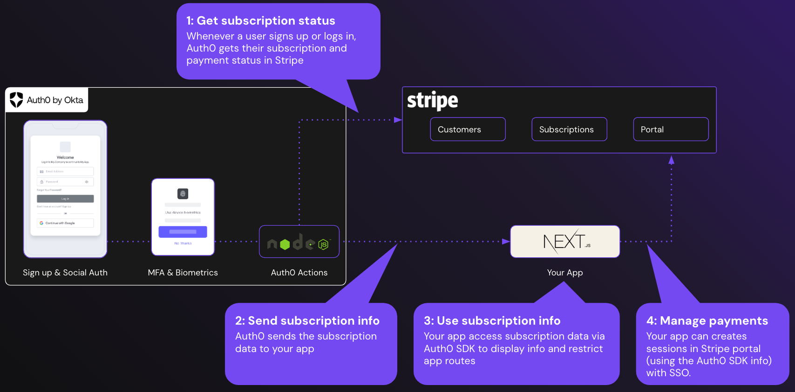

# Auth0 Next.js Stripe

This code expands on the Auth0 Next.js Quickstart by integrating the sample with Stripe subscriptions and portal. It uses the nextjs-auth0 library for authentication and provides an example of how to integrate the Auth0 Next.js SDK into your Next.js applications.

For more information, please refer to the following resources:
- Auth0 Next.js Quickstart: [Auth0 Next.js Quickstart](https://auth0.com/docs/quickstart/webapp/nextjs)
- nextjs-auth0 library: [nextjs-auth0](https://github.com/auth0/nextjs-auth0)
- Auth0 Actions for Stripe: [Actions](./Actions)
- Sample application: [Sample-01](./Sample-01)

## How Auth0 and Stripe works together?

With Auth0 actions, you can add custom logic (using NodeJS) to identity flows like sign up and login. 

In this sample, whenever a user signs up and logs in via Auth0, an [Auth0 action](./Actions/stripe-sync.js) communicates with Stripe (using [Stripe's official node js library](https://www.npmjs.com/package/stripe)) to get the latest subscription status. The subscription status is then [sent to the sample app via id token](./Actions/stripe-sync.js#L72-L74) in JWT format.

This example also demonstrates how you can take advantage of the subscription information using `@auth0/nextjs-auth0/client` to:
- [show subscription info](./Sample-01/app/profile/page.jsx#L34-L36)
- [restrict access to specific app routes](./Sample-01/components/NavBar.jsx#L47-L53) 
- [create a session with Stripe Portal](./Sample-01/app/api/billing/route.js), so end users can manage their subscription without re-authenticating in Stripe

## What is Auth0?

Auth0 helps you to:

* Add authentication with [multiple sources](https://auth0.com/docs/identityproviders), either social identity providers such as **Google, Facebook, Microsoft Account, LinkedIn, GitHub, Twitter, Box, Salesforce** (amongst others), or enterprise identity systems like **Windows Azure AD, Google Apps, Active Directory, ADFS, or any SAML Identity Provider**.
* Add authentication through more traditional **[username/password databases](https://auth0.com/docs/connections/database/custom-db)**.
* Add support for **[linking different user accounts](https://auth0.com/docs/users/user-account-linking)** with the same user.
* Support for generating signed [JSON Web Tokens](https://auth0.com/docs/tokens/json-web-tokens) to call your APIs and **flow the user identity** securely.
* Analytics of how, when, and where users are logging in.
* Pull data from other sources and add it to the user profile through [JavaScript rules](https://auth0.com/docs/rules).

## Create a Free Auth0 Account

1. Go to [Auth0](https://auth0.com) and click **Sign Up**.
2. Use Google, GitHub, or Microsoft Account to login.
